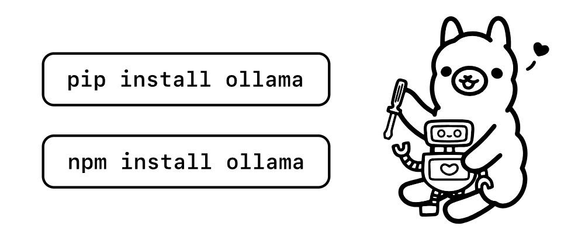

# My porte-folio :blush:

## First Step

15/11/2023 :

- [x] Démarrage du portfolio !

### Pour commencer

- [x] J'ai commencé par l'idée d'une page avec un style rétro en me rappelant l'époque des années 2000's avec des néons que j'affectionne en ce moment ^^

### Allez démarrage !!

- [x] Pour commencer j'ai préparé mon environnement de travail :
      VScode, FileZilla, mon serveur et routeur (Freebox Delta), HTML, CSS, JavaScript...
      VScode plugin's : SynthWave '84, Prettier, React Native Tools, Sublime Text Keymap, ES7+, Eslint, Github Copilot, GitHub Pull Requests...

11/12/23 :

- [x] Animation projet ILC Avant Après, création d'une page index pour choicir les styles différents du portfolio, page retro renomée, récupération
      police player 2P, refonte header "divHeaderBlock"

- [x] [Ticket BETA] bien avancé, [PAGE RETRO] résumé d'accueil, Email, decritpion projets et titres tjs apparent, titre des sections cohérent,
      numéro de version mis en dessous du titre...

23/12/2023 :

- [x] [TEST] Installation dans le HEAD de tailwind (test du "darkMode" et autres classes)

24/12/2023 :

- [x] [DEVOP] [SERVER] Mise à jour du serveur Ubuntu server 18.04 --> 20 --> 22.04 (ouf..^^')
- [x] [DEVOP] [SERVER] Mise à jour PHP 8.3
- [x] [DEVOP] [SERVER] Mise à jour Apache2
- [x] [DEVOP] [SERVER] Intégration carte NVIDIA Quadro 4200k 4Go
- [x] [DEVOP] [SERVER] Installation des pilotes CUDA, et pilote legacy 434 sur le serveur
- [x] [DEVOP] [SERVER] Suppression de Labybi dans le site pour qu'il ait sa propre adresse / dossier
- [x] [IA] Lancement test du petit model mistral dans un container: succès !
- [x] [IA] [DOCKER] tentative de personnaliser le mode dans le conteneur : échec -> doit fournir le PATH du dossier de config au lancement du conteneur ?

25/12/2023 :

- [x] [DOCKER] Installation de Docker + lazydocker (affichage info docker dans terminal avec prise en charge de la souris)
- [x] [PORTEFOLIO] Rustinage du CV.html (mes premiers code html,css,js...)
- [x] [CV] Rajout de la bibliothèque icomoon (déjà utilisée mais anciens liens manquants) (Pfiou...)
- [x] [CV] Corrections des icones manquants etc
- [x] [PORTEFOLIO] Ajout des agences de rêves avec leur adresse internet / de recrutement
- [x] [DEVOP] Restauration du débit du réseau interne ( enfin ! ) (Et ben c'était un cable réseau qui faisait du 10Mo/s... è_é )

26/12/2023 :

- [x] [PORTEFOLIO] Capture d'écran, tri des images de chaque podcast
- [x] [PORTEFOLIO] Intégration (version beta) du changement des images dans l'article section hobbies
- [x] [PORTEFOLIO] Retravaille de la taille, bordure etc. des articles
- [x] [PORTEFOLIO] Ajout de la section Diplôme

27/12/2023 :

- [x] [PORTEFOLIO] Ajout de l'association de la Gamers Assembly dans mes Hobbies
- [x] [PORTEFOLIO] Correction Mobile
- [x] [PORTEFOLIO] Ajout sélection dessin par IA dans le dossier imagas

29/12/2023 :

- [x] [PORTEFOLIO] Ajout du mini jeu engima
- [x] [IA] Découverte de LlamaIndex ( utilisation d'une BDD/n'importe quel doc pour marcher avec un Model LLM = RAG)
- [x] [IA] Renseignement sur l'utilisation d'agents ( avec CrewAI )

## **2024**

01/01/2024 :

- [x] [IA] Entrainement avec la voix de Dorothée Pousséo ( Lucy de CyberPunk EdgeRunner, margot Robbie... ) avec Bark + Hubert
- [x] [IA] Première génération de voix ( Très drole mais pas convaincant ET trop court ) // Doit essayer avec RVC(japonais)

04/01/2024 :

- [x] [PORTEFOLIO] Création de row dans projet pour aligner horizontalement
- [x] [IA] Test de jan (webUI chat et installeur Win/linux/Mac IA)

05/01/2024 :

- [x] [PORTEFOLIO] Ajout de la page serveurs
- [x] [PORTEFOLIO] [EasterEgg/Réf] Ajout du bouton "voulez-vous en savoir plus ?"
- [x] [PORTEFOLIO] Ajout de sections hobbies, diplome etc

06/01/2024 :

- [x] [DEVOP] [SERVER] Installation de whisper sur le server
- [x] [DEVOP] [SERVER] Première configuration de jan / TestGenerationWebUI en server
- [x] WORLD PREMIERE ! Sakura accessible du net et sur mobile ! Sakura extrèmement rapide (moins de context, meilleurs model),
- [x] WORLD PREMIERE ! Sakura peut dessiner et générer des images ! Aussi les comprendre !! (intégration de ma 2ème CG pour charger Sakura dans l'une
      et Stable Diffusion dans l'autre)

07/01/2024 :

- [x] [IA] Installation et découverte de Gradio ( librairie Python gratuite pour affichage web opti pour LLM etc. )
- [x] [IA] [3D] Découverte des 3D gaussian splatting, clip crée : https://youtube.com/clip/UgkxsPYuzADp_49WrRAOeFO1V8PhfWwL4NDN?si=08IIb3AZx6t2Zo2s
- [x] [IA] Tentative d'utilisation de model LLM avec quantisation en q4 puis fp16 à la volé avec Mixtral, echec si moins de 30 Go de VRAM, test avec
      un model déjà quantisé en GPTQ + décharge de ce qui ne rentre pas dans les 24 Go vers le CPU ( tuto de chez Mistral : https://huggingface.co/blog/mixtral#load-mixtral-with-4-bit-quantization)

08/01/2024 :

- [x] [IA] Utilisation de mistralai_Mistral-7B-Instruct-v0.2 ( vanilla ) + le bon template = super OK ! ( mais Tiny Mistral is in English )
- [x] [NB] [FRENCH_TECH] the most hyped tech startups in the French tech ecosystem: Dust, Finegrain, Gladia, Mistral AI and Scenario

10/01/2024 :

- [x] [TEST] Découverte de pipX pour installer des pacquets python en venv ( sudo apt update, sudo apt install pipx, pipx ensurepath )
- [x] [IA] Utilisation de python venv pour installer Gradio puis les paquets transformers, PyTorch et le model gpt2 À L'AGENCE. IA LOCAL ok !
- [x] [TUTO] Django !

11/01/2024 :

- [x] [IA] Utilisation de Python venv pour installer vLLM et ses paquets
- [x] [IA] Utilisation de ray et parralélisation de la charge sur mes 2 GPU (!!!!!!ENORME, ma première parralélisation!!!)

- /!\ ---> Réunion École 42! : imane@42paris.fr

12/01/2024 :

- [x] [TUTO] Django #2/#3
- [x] [COFFEE] pause Théatre ! 1ère partie : Jouer l’archive (Vichy octobre-décembre 1940) / 2ème : Nous serons éphémères mais immenses (slam de Catherine Dorion)

13/01/2024 :

- [x] [DEVOP] [SERVER] Je garde que le serveur#1 (conso environs 15€/mois/serveur (pour 100Watt/h))
- [x] [DISCORD] Contact avec Jmorgan développeur de Ollama pour vérifier mes logs (prblm sur WSL2 avec sa dernière version)
- [x] [BACKEND] Achat de clément-portefolio.fr (avec accent) et création du sous domaine www.labybi.clément-portefolio.fr chez OVH
- [x] [BACKEND] Configuration de Apache2 pour mes 2 hôtes virtuels et utilisation de Certbot pour valider le HTTPS !

14/01/2024 :

- [x] [IA] Découverte de exLlamaV2 (Bon usgage des CG et de la quantisation, à tester et à tester avec Mistral/Mixtral)
- [x] [ECOLE42] Préparation de la lettre de demande d'intégration (OMG...)
- [x] [PATCH/MAJ] Corrections, liens, Labybi sur Github etc

15/01/2024 :

- [x] Entrainement et passage des test en ligne de [ECOLE42] !!!
- [x] [TUTO] Django #3/#4

16/01/2024 :

- [x] [TUTO] Django #4
- [x] [ECOLE42] Résultat des tests valdidés !!! Envoi d'un Email à imane *croise les doigts*1000
- [x] [COFEE] Balade dans Paris 6 et parc luxembourg, photo d'une peruche :)

17/01/2024 :

- [x] [ECOLE42] Attente, atente ^^'
- [x] [TUTO] Django #4
- [x] [DEVOP] [BACKEND] [URGENCE] [DOWN]
      11h20 : server perso chez moi down après un reboot de mon serveur qui a fait une MaJ -->
      [x] location server chez OVH et demande installation Ubuntu
      [x] connexion en ssh server OVH
      [x] installation de apache2
      [x] demande à Bard pour me rappeler un fichier type de configuration mon*site.conf
      [x] ajout des lignes ServerName, DocumentRoot *80 et \*443 et chemin vers key et certificat
      [x] démarrage de Apache2
      [x] installation de certbot + python3-certbot-apache  
      [x] changement de la redirection de mon IP vers l'IP du serveur OVH pour mon nom de domaine
      [x] propagation DNS instantanée !
      [x] lancement de certbot qui vérifie si le nom de domaine renvoit bien là où il est installé et génère mes clefs SSL
      [x] création d'un dossier portefolio dans /var/www et changement des permissions pour ajouter moi et www-data pour apache2
      [x] connexion en sftp:// et transfert des fichiers du portefolio.
      12h27 : portefolio accessible !!!! \*fière ^^

18/01/2024 :

      -[x] [TALK] Préparation et exposé pour les collègues sur la découverte et l'arrivée de l'IA, différents modèles,
            ollama, janai, web_text_generation etc.

19/01/2024 :

- [x] [TUTO] Django #4
- [x] [TALK] Rattrapage découverte IA
- [x] [IA] [LINUX] Maj de Linux, driver Nvidia... Essai de ollama qui tourne sur les 2 GPU d'office!

20/01/2024 :

- [x] [IA] Test de pixart alpha / delta ( a revoir)
- [x] [PORTEFOLIO] Ajout d'un lien vers la ferme à objet
- [x] [SERVER] [OVH] Ajout du lien et des dossiers lafermeaobjet.clément-portefolio.fr 
- [x] [TUTO] Django#5 Installation de django en venv sur WSL, démarrage
 
21/01/2024 :

- [x] [PORTEFOLIO] Corrections/ Ajouts
- [x] [COFFEE] Rangement Bureaux, Portal Revolution (fan game top!)

22/01/2024 :

- [x] [TUTO] Personnalisation du Bash  !!! Météo, citation, colorisation ( toilet, lolcat, curl la meteo etc)

23/01/2024 :

- [x] [TUTO] Django#7 insertion de laFermeAObjet et début correction des erreurs (lien avec la CSS, JS, images...)

- [x] [FUTUROLAN] Réunion avec l'asso pour peut-être intégrer l'équipe animation des 500 joueurs libres pendant l'évènement de la Gamers Assembly !(20ans déjà...)
- [x] [IA] Ollama en JS ! A tester avec Django viiiiiite

24/01/2024 : 

- [x] [TUTO] Django Début de l'app SakuraOllama pour utiliser l'API d'ollama... dur je m'embrouille entre back et front...MAIS quand ça va être clair popopooo
            A montrer au formateur les librairies Python et JS qui viennent de sortir, quel intêret avec l'utilisation de Django

- [x] [TUTO] [DJANGO] [RESTapi] [WINDOWS] [VENV] Il faut activer l'activation des scripts, même en adminsitrateur, pour lancer le venv.

- [x] [TUTO] [DJANGO] [RESTapi] [WINDOWS] [VENV] Ok ça marche, à tester avec Ollama.

25/01/2024 : 

- [x] [PYTHON] [UBUNTU.23] Toujours ajouter '--break-system-packages' avec pip install depuis ubuntu 23 (nvlle sécu) même en venv(!)
- [x] [DJANGO] Modules à voir : django-instant(websockets), installws(server websockets), djangorestframework(REST),
            huey(task queue légère),
- [x] [DJANGO] Premier POST récupéré coté Django!!! (mais pas de 'text' dans le body)

26/01/2024 :

- [DJANGO] [OLLAMA] [IA] [SAKURA] 10h34 : première réponse de Sakura en ligne. (!!!!!!!!)

27/01/2024 :

- [DJANGO] Info sur WSGI + apache2

28/01/2024 :

- [DJANGO] Python venv, Django, serveur Ollama, tout en WSL2, ajout d'alias etc, chat avec Sakura, tentative de streaming chat

29/01/2024 :

- [SAKURA] modification du template HTML avec Django pour une boucle for qui va itérer les phrases en paragraphe
            fonction dans la views pour recréer les phrases et les rentrer dans un dico.