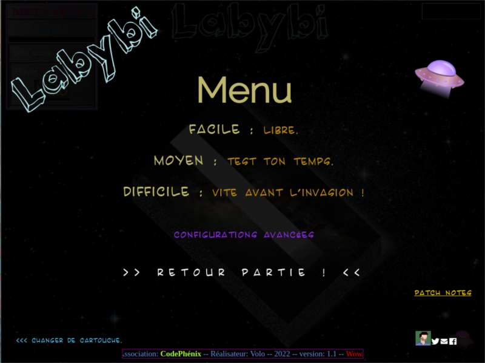

/\ ERRATUM : COMPATIBLE plutôt sur CHROMIUM /\
/\ Préférez plutôt la fenêtre moins large /\

__Bienvenue sur ce projet de jeux-vidéo !__

_c'est parti d'un exercice où je devais exclusivement utiliser de la CSS et HTML sans 
JavaScript pour faire changer les niveaux avec, quand même, l'utilisation du clic. 
A partir de là je suis allé beaucoup plus loin, avec du JavaScript, et fait un jeu complet 
pour mon rendu de diplôme. Fan des Easter Eggs d'époque, où les programmeurs cachaient des 
messages pour les utilisateurs/joueurs. 
J'aimais beaucoup ce lien que cela créait._

__Si vous voulez ne pas vous le divulgacher (spoiler) essayez de jouer sans voir le code
et surtout arriver à voir la FIN du jeu ;D__

_j'espère que vous vous amuserez !_

-v 2.3-

ajout 'perdu' différent si on touche les bords ou si le temps est écoulé, agrandissement du texte: pour meilleur 
compréhension des règles pas si évidente quand 'perdu' apparaissait sur l'écran sans que l'utilisateur pense à
bouger sa souris...

correction bug si pas de pseudo: écran de fin gardait le gif etc de l'accueil

-v 2.2-

ajout de bordurs pour bouton RELOAD et Menu car avec la balise button ça n'apparraissait pas forcément

-v 2.1-

correction hauteur gif accueille

correction placement étiquette 'out of order' (SECRET)

-v 2.0-

erreur v1.9 version de production envoyé par erreur....

ajout effacement image et règle écran accueil

longueur défilement titre Star Wars

-v 1.9-

passage titre Labybi en Fixed en grand ecran (à tester)

-v 1.8-

correction police (ajout de codystar(bouton Menu) dans le dossier fonts...)

grosse optimisation du poids 40Mo --> 8,3Mo (énorme compression des images, textures)

-v 1.7-

ajout balise meta pour compatibilité tout écran pour width: 100% soit compris partout

ajout écran bleu (of death) pour incompatibilité mobile (en dessous de 855pixel)

ajout des rêgles à l'écran de pseudo

ajout du .pdf et .gif de l'exercice de départ !

-v 1.6- (25/08/2022)

ajout fonction pseudo en Majuscule pour éviter de sauvegarder 2 scores différents 
si le nom est rentré avec ou sans majuscule

-v 1.5-

compatibilité Firefox : en cour...

correction police (ajout de Karatula dans le dossier fonts...)

-v 1.4-

ajout (enfin !!!) de l'info '+ 5sec' et en suivi sur le curseur !

correction bug générique sur grande fenêtre

-v 1.3-

suite retour Guillaume ajout bouton RELOAD pour relancer la partie rapidement
suite retour Guillaume passage à 7 secondes(avant 5s) pour le départ  

NewEgg Nom [SECRET][SECRET]

-v 1.2-

[effacer mon score] : ne supprime plus tout le localStorage

ajout lien patch notes au menu 

ajout d'une 'PP' avec les (faux) lien vers Twitter, Email...

fin modifiée : ralentissement des soucoupes /2

générique fin modifié (Craspouille, Cody)

couverture espace niveau2 corrigée (cover)

meilleur cosmétique fin_% à la ff7 :)

-v 1.1-

centrage générique début, message bonus

fin de la mise en place de la barre info grand écran

corrections bugs

-v 1.0-

meilleur cosmétique fin_%

menu new record Maj

NewEgg Nom[SECRET][SECRET][SECRET]

cosmétique générique fin

correction longueur pseudo (merci Craspouille ;)

corrections bugs

enregistrement des scores !

-v 0.9-

fin générique non bloquante (finit le F5 pour rejouer !)

image dans ReadMe.md pour GitLab

corrections bugs

changement Menu (+ compréhensible) suite au retour des bêta-tester

-v 0.8-

générique de fin, déplacement H1

monde rond qui tourne ! (les pros voulaient de la difficulté...)

corrections bugs

curseur soucoupe enlevé pour croix sur le menu suite au retour des bêta-tester

le temps s'arrête et reprend l'ors des retours menu !

-v 0.7-

refont menu

ajout bonus temps pour [SECRET] [SECRET] 

utilisation importante de 'regexATester'.lastindex = 0 pour la fonction test() qui doit
être réinitialiser à chaque fois pour commencer au DEBUT du Regex que l'on veut tester !

EEgg ajoutés à [REDACTED]

bonton SKIP ajouté (parce que c'est bien mais c'est long le générique StarWars(r)...

-v 0.6-

text flottant 'fin non disponible' dans le menu

formulaire pseudo

test : niveau dans un monde rond avec une grid + petite

-v 0.5-

ajout titre du jeu

ajout difficulté au Menu pour aider au choix

ajout crédit / générique 

ajout d'une fin 

-v 0.4-

animation portes

ajout de textures

ajout d'un icone soucoupe

ajout de fond d'écran de l'espaaaace

-v 0.3-

ajout d'un petit menu

fonction aléatoire et
ajout du bouton de chargement des niveaux en aléatoire

-v 0.2-

ajout d'un chronos en JS

-v 0.1-

exercice de labyrinthe avec changement de parcours seulement en css/html

utilisation de Grid et plusieurs div pour créer le chemin

